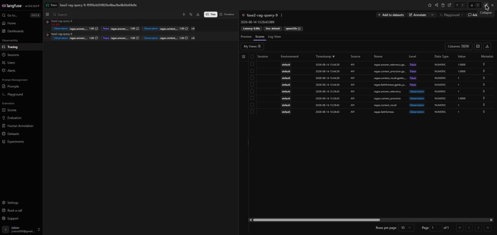
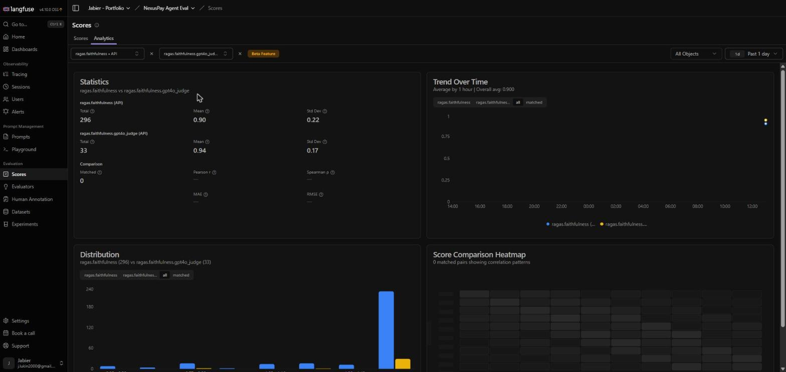

# llm-rag-hybrid-benchmark

RAG hybrid benchmark comparing advanced retrieval techniques and self-hosted inference cost on synthetic API documentation.  
**Gemma 3 27B AWQ** vs **Qwen 2.5 32B AWQ** vs **Gemma 4 31B AWQ** — bge-m3 embeddings, HyDE, re-ranking, deterministic router, cost-per-query on real GPU pricing.

## What this measures

Building on [llm-rag-benchmark](https://github.com/ko2javier/llm-rag-benchmark), this benchmark addresses the root cause identified in Phase 1-2: the embedding model was the bottleneck.

Tested variables:
- Embedding: `all-MiniLM-L6-v2` (baseline) vs `BAAI/bge-m3` (multilingual, technical)
- Retrieval: standard vs HyDE (Hypothetical Document Embeddings)
- Re-ranking: none vs `cross-encoder/ms-marco-MiniLM-L-6-v2` vs `BAAI/bge-reranker-v2-m3`
- Routing: rules-based router vs RAG-only for exact fact queries

## Dataset

Synthetic documentation for a fictional payment API (NexusPay):
- 25 markdown files — reference docs + narrative guides
- 572 chunks (chunk_paragraph strategy)
- 50 golden questions: 25 semantic + 25 deterministic (exact facts)

## Experiments

| Experiment | What it tests | Status |
|---|---|---|
| A | Self-hosted RAG (bge-m3, semantic retrieval) across 3 candidate LLMs — quality (RAGAS) + real GPU cost/query | ✅ Done (31 Jul 2026) — see [`results/`](results/INFORME_FASE2_RESULTADOS.md) |
| B | HyDE vs standard retrieval, semantic questions only — cost vs quality tradeoff | ✅ Done (01 Aug 2026) — see §13 of the report |
| C | bge-reranker-v2-m3 vs ms-marco vs no re-ranker | Not started — deprioritized, doesn't target a weakness the data actually showed |
| D | Deterministic router + `api_facts` lookup vs RAG-only, deterministic questions only | ✅ Done (01 Aug 2026) — see §12 of the report |

## Results (Exp A — self-hosted cost & quality, 31 Jul 2026)

Full report with methodology, incidents, and per-question-type breakdown: [`results/REPORT_FASE2_RESULTS.md`](results/REPORT_FASE2_RESULTS.md) (English) / [`results/INFORME_FASE2_RESULTADOS.md`](results/INFORME_FASE2_RESULTADOS.md) (Spanish original). Raw CSVs (latency/cost + RAGAS scores per model) in [`results/`](results/).

**Setup:** 1× RTX 6000 Ada (48GB) on Vast.ai, $0.6966/h real instance price, vLLM + AWQ quantization, RAGAS-judged by Mistral 7B Instruct (third model family, to avoid self-preference bias).

| Model | Latency | Cost/query | Faithfulness | Answer relevancy | Context precision | Context recall |
|---|---|---|---|---|---|---|
| Gemma 3 27B AWQ | 1.30s | $0.000252 | 0.874 | 0.856 | 0.959 | 0.924 |
| Qwen 2.5 32B AWQ | 1.37s | $0.000266 | **0.936** | 0.836 | **0.968** | 0.883 |
| Gemma 4 31B AWQ | **1.01s** | **$0.000196** | 0.888 | **0.879** | 0.961 | 0.895 |

**Headline findings:**
- **No single winner.** Gemma 4 31B is fastest/cheapest and best on deterministic questions, but its faithfulness drops the most on semantic (narrative) questions. Qwen 32B is the most balanced but slowest/most expensive. The right pick depends on the real production question mix.
- **Self-hosting doesn't pay off at demo volume.** Break-even vs the reference APIs (GLM-5.2, Kimi K3) sits between ~250K and ~2.2M queries/month assuming a GPU running 24/7 — far above portfolio/demo traffic. The value of this exercise is the deployment/measurement rigor, not immediate savings (see report §8 for the nuance on burst/spot pricing changing this math).

## Results (Exp D — router-backed lookup, Exp B — HyDE, 01 Aug 2026)

Full breakdown in [`results/REPORT_FASE2_RESULTS.md`](results/REPORT_FASE2_RESULTS.md) §12-13 (English) / [`results/INFORME_FASE2_RESULTADOS.md`](results/INFORME_FASE2_RESULTADOS.md) §12-13 (Spanish). Two bugs were found and fixed *before* spending any GPU time on this, by validating `router.classify()` offline against the golden dataset: `normalize()` was dropping "IP-level" down to `"iplevel"` (losing the `"ip"` token), and the `constraint` rule's keyword map collapsed two different refund questions onto the same fact. Both fixed, re-validated 25/25 offline, then run for real.

**Exp D (router + `api_facts` lookup, deterministic questions only):** all 25/25 questions resolved via exact lookup in all three models, at ~5-6x lower latency/cost than semantic RAG. `context_precision`/`context_recall` hit **1.000** in all three models, confirming the hypothesis from Exp A. But faithfulness/answer_relevancy did **not** improve uniformly — they dropped in 2 of 3 models. Two distinct causes, verified row by row: (1) answer_relevancy drops everywhere because exact-fact answers are short ("1000", "v2") and RAGAS's relevancy metric penalizes terse answers regardless of correctness; (2) faithfulness genuinely drops for Gemma 4 31B (-0.12) and Qwen 32B (-0.075) because those models sometimes respond "the provided text does not contain..." even though the fact is right there in the prompt, in compact JSON instead of prose — Gemma 3 27B didn't have this problem (25/25 correct). The router's retrieval-side promise holds; the fact-lookup prompt template needs work for non-Gemma-3 models.

**Exp B (HyDE, semantic questions only):** confirms the hypothesis cleanly — `context_recall` improves in all three models, and the model that gains the most is exactly the one that needed it most: Gemma 4 31B, which had the worst semantic faithfulness in Exp A (0.833), jumps to 0.934 (+0.101) and recall +0.127. Costs ~2.5-3x more latency/query than plain semantic RAG (two LLM calls instead of one) — a reasonable trade if semantic/narrative questions are a meaningful share of expected production traffic.

## Methodology check — does the RAGAS judge model matter? (14–15 Aug 2026)

All RAGAS scores above were computed with a local **Mistral 7B Instruct** judge, chosen for cost/risk reasons (no paid API key exposed on a third-party rented GPU). To check whether that choice affects the reported numbers, traces from Exp A were ingested into a self-hosted [Langfuse](https://langfuse.com) instance and re-scored with two independent frontier judges — **gpt-4o** (OpenAI) and **DeepSeek-v4-pro** (DeepSeek) — across the **full 150-row set** (all 3 models × 50 questions), not just a sample. Full methodology, the initial 30-row sample, and per-metric deltas in [`POSTMORTEM.md`](POSTMORTEM.md) (§H1).

**Final table, average of the 3 models, 150/150 rows, no missing data:**

| Metric | Mistral (local) | gpt-4o | DeepSeek | Read |
|---|---|---|---|---|
| `context_precision` | 0.963 | 0.767 (−0.196) | 0.776 (−0.187) | **Judge-general effect** — near-identical magnitude across 2 unrelated vendors |
| `context_recall` | 0.901 | 0.807 (−0.094) | 0.780 (−0.121) | **Judge-general effect** — same direction, similar magnitude |
| `answer_relevancy` | 0.857 | 0.901 (+0.044) | 0.871 (+0.014) | Same direction, but gpt-4o's effect is ~3x DeepSeek's — judge-specific magnitude, not generic |
| `faithfulness` | 0.899 | 0.902 (+0.003) | 0.915 (+0.016) | **No consistent effect** — a real revision of the original finding below |

Both judges' scores were attached side by side to the same Langfuse traces, so any single query's dual-judge comparison is inspectable in the UI:

Aggregated across all sampled traces, Langfuse's built-in score analytics confirm the same direction found per-model above (`faithfulness`: local mean 0.90 vs gpt-4o mean 0.94, from the original 30-row sample):

**Conclusion, revised with full data:** `context_precision`/`context_recall` are a genuine, systematic **local-vs-frontier judge effect** — near-identical magnitude between two architecturally unrelated vendors (OpenAI, DeepSeek), not a gpt-4o quirk, not sampling noise. `answer_relevancy` keeps its direction but the magnitude is judge-specific. The initial 30-row sample also suggested `faithfulness` scored consistently higher under gpt-4o across all 3 models — with full 150-row coverage and a second independent judge, that does **not** hold: per-model deltas are mixed in sign and the aggregate is nearly flat for both frontier judges. This is a real revision of the original claim, not just "confirmed at scale." Practical implication stands regardless: **any report citing RAGAS numbers should name the judge model.**

## Next steps

- **Fix the Exp D fact-lookup prompt** — `build_fact_prompt()` currently injects the `api_facts` value as raw JSON; try a templated sentence instead ("The {plan} plan allows {limit} requests per {window}.") to see if that closes the faithfulness gap on Gemma 4/Qwen without losing the precision/recall win.
- **Exp C (re-ranking)** — script exists, still not run. Deprioritized twice now — only pick it up if a future data point actually motivates it.
- **Quality-per-dollar view** — combine cost and RAGAS quality into one score (e.g. faithfulness / cost-per-query) instead of two separate tables, across all of Exp A/B/D.
- **Model the break-even under realistic traffic** (bursty + scale-to-zero / spot pricing) instead of GPU-24/7 — the report flags this as the biggest unmeasured nuance in the cost conclusion (§8.2).

## Repository structure
docs/reference/    # Rate limits, endpoints, error codes
docs/guides/       # Narrative guides (18 files)
dataset/           # Golden dataset — 50 questions
scripts/           # chunker.py, ingest.py, evaluator.py, hyde.py, router.py, ragas_eval.py
sql/               # PostgreSQL schema and seed data
results/           # Exp A results: report + per-model CSVs (latency, cost, RAGAS scores)

## Author

K. Jabier O'Reilly — [cv.ko2-oreilly.com](https://cv.ko2-oreilly.com) — [@ko2javier](https://github.com/ko2javier)
